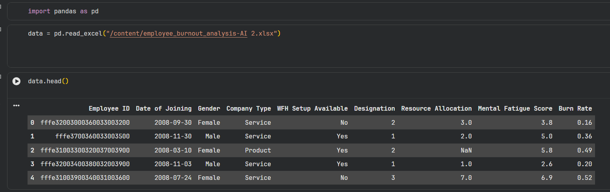
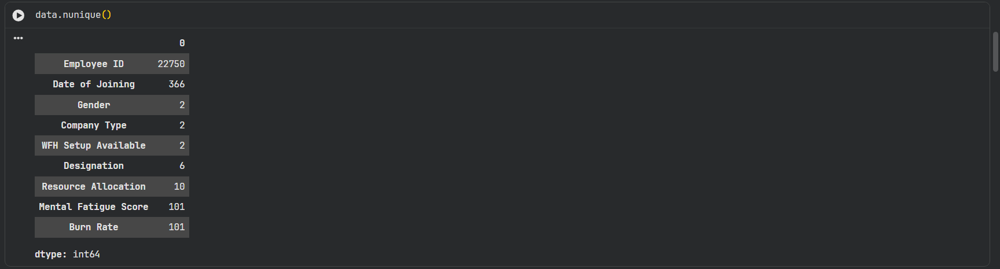
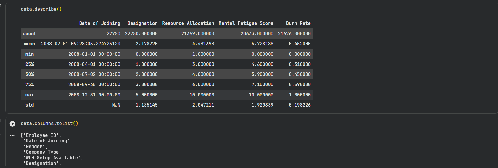
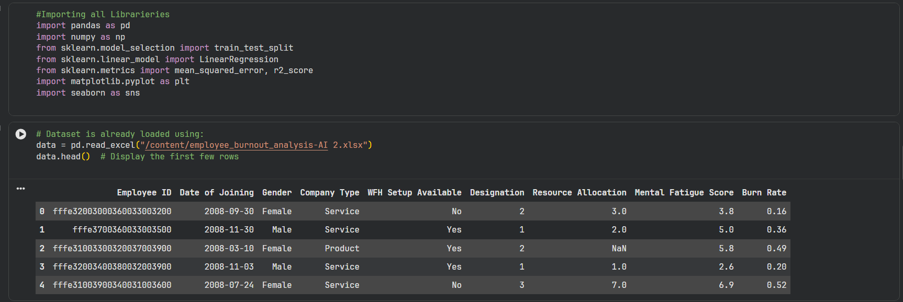
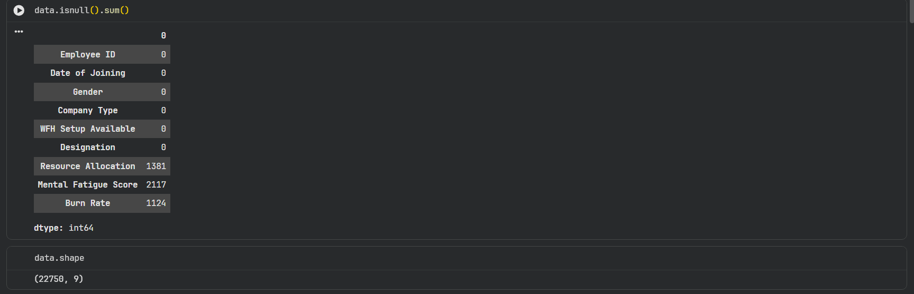
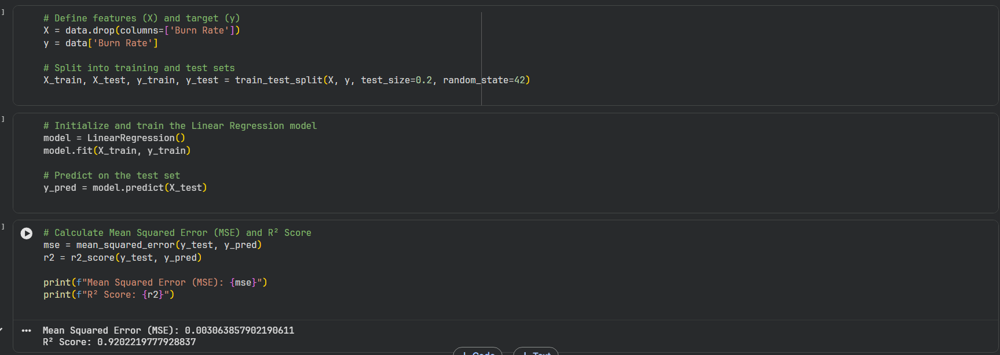
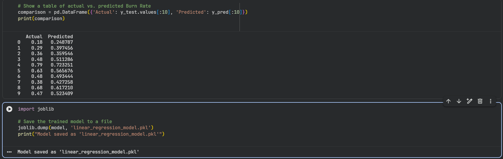
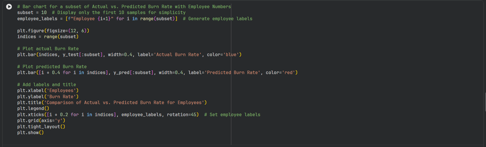
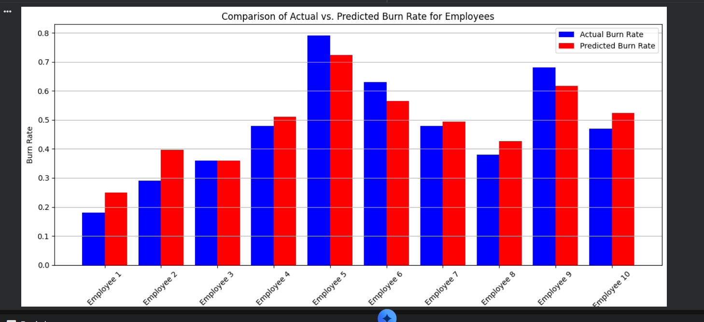

# 📊 Employee Burnout Prediction using Linear Regression

## 🔍 Overview
This project predicts **employee burnout rate** using a **Linear Regression model**.

It uses important workplace factors like:
- Resource Allocation  
- Mental Fatigue Score  
- Work From Home Setup  

---

## 📁 Dataset

### 🧾 Sample Data Preview


---

### 📊 Dataset Shape


- Total Rows: **22,750**  
- Columns: **9**

---

### ❗ Missing Values Analysis


---

### 📈 Statistical Summary


---

### 🔢 Unique Values


---

## ⚙️ Data Preprocessing

### 🧹 Cleaning & Encoding


Steps:
- Dropped unnecessary columns (Employee ID, Date of Joining)  
- Removed missing values  
- Applied One-Hot Encoding  

---

## 🤖 Model Building

### 🏗️ Train-Test Split


### 🧠 Model Training


- Model Used: **Linear Regression**

---

## 📊 Model Evaluation

### 📉 Performance Metrics


- **Mean Squared Error (MSE):** ~0.003  
- **R² Score:** ~0.92 ✅  

---

---

## 🛠️ Technologies Used

- Platform: Google Colab  
- Language: Python  

Libraries:
- pandas  
- numpy  
- scikit-learn  
- matplotlib  
- seaborn  

---

## ▶️ How to Run

1. Clone the repository:
```bash
git clone https://github.com/yourusername/your-repo-name.git
````

2. Open in Google Colab

3. Install dependencies:

```bash
pip install pandas scikit-learn matplotlib seaborn openpyxl
```

4. Run all cells

---

## 📬 Contact

* **Name:** Vikyraj Deka
* **Email:** [vikyrajdekawork@gmail.com](mailto:vikyrajdekawork@gmail.com)

---

⭐ If you like this project, give it a star!

```

---

## 🔥 What makes this good

- Clean structure  
- Proper image linking (using `Preview/`)  
- Easy to understand  
- Looks professional on GitHub  

---

If you want next upgrade:
👉 I can add **badges, project demo style, and make it resume-level strong** 🚀
```
